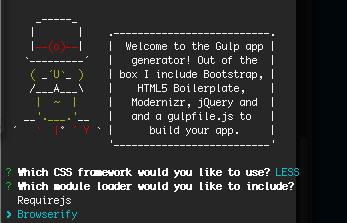

> [Yeoman](http://yeoman.io) generator that scaffolds out a front-end web app using [gulp](http://gulpjs.com/) for the build process

## Features

Please see our [gulpfile.js](app/templates/gulpfile.js) for up to date information on what we support.

* React, A JavaScript library for building user interfaces
* Built-in preview server with livereload
* Automagically compile with either Sass or Less
* Awesome image optimization
* Module loading using CommonJs Browserify

*For more information on what this generator can do for you, take a look at the [gulp plugins](app/templates/_package.json) used in our `package.json`.*

## Getting Started

- Install: `npm install -g generator-gulp-app`
- Run: `yo gulp-app`
- Run `gulp` for building to the `dist` directory and `gulp serve` for preview

## Options

- `--skip-install`
  Skips the automatic execution of `bower` and `npm` after scaffolding has finished.

- `--test-framework=<framework>`
  Defaults to `mocha`. Can be switched for another supported testing framework like `jasmine`.

## License

[MIT license](http://opensource.org/licenses/MIT)

